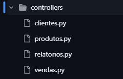

## <span style="color: #ff5c5c;">Especifico para abordar a separação dos arquivos no projeto</span>
---
# <span style="color: #ff5c5c;">Antes até de começar é bom deixar bem claro aqui: tome bastante cuidado com suas importações para que sejam consistentes e não criem referência circular (um arquivo importando o outro) para não dar erro</span>

# Blueprints
## Blueprint é uma maneira de modularizar (separar) as rotas em diferentes partes em diferentes arquivos para facilitar a localização e configuração
## Ela terá configurações diversas, porém, estarei abordando apenas as básicas que foram passadas no decorrer das aulas

```py
#Configuração da blueprint "usuários" do arquivo usuarios.py
usuarios_bp = Blueprint(name='usuarios', #Nome da blueprint que será necessário para chamar as funções dela, será exemplificado jajá
                        import_name=__name__, #Apenas o nome de importação, coloque __name__ pra ser o nome do proprio arquivo
                        template_folder="templates", #Pasta padrão dos arquivos .html dessa blueprint
                        url_prefix="/usuarios") #URL padrão que terá antes do nome das rotas, será exemplificado
```

## Atributo name=
### Quando você precisar chamar uma função utilizando o <span style="color: #f7b783;">url_for( )</span>, será preciso especificar a qual blueprint a função pertence
### Use o blueprint . função
### Exemplo da função <span style="color: #f7b783;">register</span> da blueprint  <span style="color: #f7b783;">"usuários"</span> sendo chamada no arquivo  <span style="color: #f7b783;">templates/register.html</span>:

```html
<form action="{{url_for('usuarios.register')}}" method='post' class="registro-form">
```

### Caso queira chamar uma função do <span style="color: #4fb6ff;">app</span> basta não especificar blueprint

```py
#Linha 26 de controllers/usuarios.py
return redirect(url_for('index'))
```

## Atributo url_prefix=
### Servirá para configurar um prefixo de url padrão entre todas as rotas
### Exemplificando, a rota a seguir está configurada como <span style="color: #f7b783;">/register</span>, porém, a sua url será <span style="color: #f7b783;">/usuarios/register</span>

```py
@usuarios_bp.route('/register', methods=['POST','GET'])
```


---

## Importação e registro das blueprints no app
### Para que o flask reconheça as rotas das blueprints, basta que você as importe no arquivo principal (<span style="color: #4fb6ff;">app.py</span>) e use o comando de registrar

```py
from controllers.usuarios import usuarios_bp
```

### Aqui ele importa a blueprint do arquivo controllers/usuarios.py para então registrar no app com o seguinte comando:

```py
app.register_blueprint(usuarios_bp)
```

# Pastas
## controllers/.
### Nessa pasta estarão os arquivos de criação e configuração das BLUEPRINTS, eles preferencialmente estarão separados no que a rota está manipulando



### (Exemplo tirado de outro projeto por ter mais coisa, nesse projeto serão apenas usuários, livros e empréstimo)
### <span style="color: #ff5c5c;">GERALMENTE</span> os controllers vão conter o CRUD (Create, Read, Update, Delete) de cada modelo (tabela) do seu sistema
### Foco no geralmente por que nada é absoluto em programação, vai de quem ta fazendo e vai variar MUITO de projeto pra projeto

---

## models
### A pasta models será responsável por guardar os modelos (ava é memo).
### Provavelmente você vai estar usando sqlalchemy, então, precisará criar os modelos em algum arquivo python, e pra isso que serve essa pasta


### Outro exemplo tirado do mesmo projeto, essas são todas as tabelas do nosso banco de dados, nesse projeto em especifico serão apenas usuários, livros e empréstimo